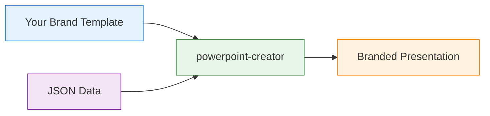

# 🎯 powerpoint-creator

<div align="center">
  <h3>✨ Professional PowerPoint Generator with Template Support ✨</h3>
  <p><strong>Transform JSON into stunning, business-ready presentations programmatically</strong></p>
  
  <p>
    
    
    
    
  </p>
</div>

---

## 🌟 Why powerpoint-creator?

> **Stop manually creating repetitive presentations.** Generate professional PowerPoint files programmatically with complete control over styling, templates, and content.

<div style="background: #f0f9ff; border-left: 4px solid #0ea5e9; padding: 15px; margin: 20px 0;">
  <strong>💡 Perfect for:</strong>
  <ul>
    <li>📊 Automated business reports and dashboards</li>
    <li>📈 Data-driven presentations from APIs/databases</li>
    <li>🎯 Marketing decks with dynamic content</li>
    <li>🏢 Corporate presentations with brand templates</li>
    <li>📱 SaaS platforms needing presentation export</li>
  </ul>
</div>

---

## ✨ Features at a Glance

<table>
  <tr>
    <td width="50%">
      
### 🎨 **Rich Content Support**
- Title slides with professional layouts
- Multi-level bullet points with HTML formatting
- High-quality image rendering
- 7 chart types (bar, line, pie, and more)
- Styled tables with custom formatting
- Speaker notes integration
- Custom layouts with precise positioning

    </td>
    <td width="50%">

### ⚡ **Developer-Friendly**
- **TypeScript** - Full type safety
- **CLI & API** - Use anywhere
- **JSON Schema** - Validated input
- **Template Engine** - Brand consistency
- **PDF Export** - One-click conversion
- **Error Handling** - Detailed feedback
- **Extensible** - Add custom layouts

    </td>
  </tr>
</table>

---

## 🚀 Quick Start

### 📦 Installation

<div style="display: flex; gap: 20px;">
  <div style="flex: 1;">
    
**Global CLI Installation**
```bash
npm install -g powerpoint-creator
```

  </div>
  <div style="flex: 1;">
    
**Project Installation**
```bash
npm install powerpoint-creator
```

  </div>
</div>

### 🎯 Create Your First Presentation

#### **Option 1: CLI** (Fastest)
```bash
# Generate from JSON file
powerpoint-creator --input slides.json --output my-presentation.pptx

# Use a corporate template
powerpoint-creator --input slides.json --template corporate.pptx --output final.pptx

# Convert to PDF automatically
powerpoint-creator --input slides.json --output presentation.pptx --pdf
```

#### **Option 2: Programmatic API**
```typescript
import { generatePresentation } from 'powerpoint-creator';

const presentation = {
  title: "Q4 2024 Results",
  author: "Jane Smith",
  slides: [
    {
      layout: "title",
      title: "Quarterly Business Review",
      subtitle: "Record-Breaking Performance"
    },
    {
      layout: "chart",
      title: "Revenue Growth",
      chartType: "line",
      data: {
        labels: ["Q1", "Q2", "Q3", "Q4"],
        datasets: [{
          label: "Revenue ($M)",
          data: [8.2, 9.5, 11.3, 14.7],
          backgroundColor: "#4472C4"
        }]
      }
    }
  ]
};

await generatePresentation({
  inputData: presentation,
  outputPath: 'q4-results.pptx',
  templatePath: 'brand-template.pptx' // optional
});
```

---

## 📊 Slide Layouts Gallery

### 🎯 Available Slide Types

<div style="background: #f9fafb; padding: 20px; border-radius: 8px;">

#### **1️⃣ Title Slide**
Professional opening slides with your branding

```json
{
  "layout": "title",
  "title": "2024 Annual Report",
  "subtitle": "Exceptional Growth & Innovation",
  "author": "Leadership Team",
  "date": "March 2024",
  "backgroundColor": "#003366"
}
```

#### **2️⃣ Text/Bullet Slide**
Clear, hierarchical content presentation

```json
{
  "layout": "text",
  "title": "Key Achievements",
  "bullets": [
    "<strong>Revenue:</strong> Exceeded targets by 35%",
    "<strong>Market Share:</strong> Gained 5 percentage points",
    "  • Expanded to 3 new regions",
    "  • Launched 2 flagship products",
    "<strong>Team:</strong> Grew by 40% while maintaining culture"
  ]
}
```

#### **3️⃣ Chart Slide**
Data visualization with multiple chart types

```json
{
  "layout": "chart",
  "title": "Performance Metrics",
  "chartType": "bar",  // bar | line | pie | area | scatter | doughnut | radar
  "data": {
    "labels": ["Jan", "Feb", "Mar", "Apr"],
    "datasets": [{
      "label": "Sales",
      "data": [42, 55, 67, 81],
      "backgroundColor": "#4472C4"
    }]
  }
}
```

#### **4️⃣ Table Slide**
Structured data with professional styling

```json
{
  "layout": "table",
  "title": "Regional Performance",
  "headers": ["Region", "Revenue", "Growth", "Target"],
  "tableData": [
    ["North America", "$5.2M", "+28%", "✅ Exceeded"],
    ["Europe", "$3.8M", "+42%", "✅ Exceeded"],
    ["Asia Pacific", "$2.1M", "+55%", "✅ Exceeded"]
  ],
  "styling": {
    "headerBackground": "#003366",
    "alternateRows": true
  }
}
```

#### **5️⃣ Image Slide**
Visual content with captions

```json
{
  "layout": "image",
  "title": "Product Showcase",
  "imageUrl": "https://example.com/product.jpg",
  "caption": "Our award-winning design",
  "sizing": "contain"
}
```

</div>

---

## 🎨 Professional Templates

### 🏢 Using Corporate Templates

Transform any existing PowerPoint into a reusable template:



```bash
# Your template preserves:
# ✅ Corporate colors and fonts
# ✅ Logo placement
# ✅ Slide masters
# ✅ Brand guidelines

powerpoint-creator --input data.json --template corporate-brand.pptx --output final.pptx
```

---

## 📐 CLI Reference

### ⚙️ Command Options

| Option | Alias | Description | Example |
|--------|-------|-------------|---------|
| `--input` | `-i` | JSON input file or STDIN | `--input slides.json` |
| `--output` | `-o` | Output PPTX path | `--output presentation.pptx` |
| `--template` | `-t` | Template PPTX file | `--template brand.pptx` |
| `--pdf` | `-p` | Convert to PDF | `--pdf` |
| `--verbose` | `-v` | Detailed logging | `--verbose` |
| `--help` | `-h` | Show help | `--help` |

### 💡 Pro Tips

<div style="background: #f0fdf4; border-left: 4px solid #22c55e; padding: 15px; margin: 20px 0;">

**🚀 Performance Optimization**
```bash
# Process multiple presentations in parallel
for file in *.json; do
  powerpoint-creator --input "$file" --output "${file%.json}.pptx" &
done
wait
```

**📊 Dynamic Data Integration**
```bash
# Generate from API response
curl https://api.example.com/data | powerpoint-creator --output report.pptx
```

**🎯 Batch Processing**
```bash
# Convert all presentations to PDF
find . -name "*.json" -exec powerpoint-creator --input {} --output {}.pptx --pdf \;
```

</div>

---

## 🛠️ Advanced API Usage

### 📦 TypeScript Integration

```typescript
import { 
  generatePresentation, 
  validateInput,
  Presentation,
  SlideLayout 
} from 'powerpoint-creator';

// Full type safety with TypeScript
const createSalesPresentation = async (data: SalesData): Promise<void> => {
  const presentation: Presentation = {
    title: "Sales Report",
    author: data.author,
    theme: {
      primaryColor: "#1976D2",
      fontFamily: "Segoe UI"
    },
    slides: data.metrics.map(metric => ({
      layout: "chart" as SlideLayout,
      title: metric.title,
      chartType: "bar",
      data: formatChartData(metric)
    }))
  };

  // Validate before generating
  const validation = validateInput(presentation);
  if (!validation.valid) {
    throw new Error(`Invalid input: ${validation.errors}`);
  }

  await generatePresentation({
    inputData: presentation,
    outputPath: `sales-${Date.now()}.pptx`,
    templatePath: process.env.TEMPLATE_PATH
  });
};
```

### 🔄 Streaming Large Presentations

```typescript
// Handle large datasets efficiently
import { createReadStream } from 'fs';
import { pipeline } from 'stream/promises';

const generateLargePresentation = async () => {
  const dataStream = createReadStream('large-dataset.json');
  
  await pipeline(
    dataStream,
    parseJSONStream(),
    transformToSlides(),
    generatePresentation({
      outputPath: 'large-presentation.pptx',
      streaming: true
    })
  );
};
```

---

## 📄 PDF Conversion

### 🖨️ Setup PDF Export

<table>
<tr>
<td width="33%">

**🍎 macOS**
```bash
brew install --cask libreoffice
```

</td>
<td width="33%">

**🐧 Linux**
```bash
sudo apt-get install libreoffice
```

</td>
<td width="33%">

**🪟 Windows**
Download from [libreoffice.org](https://www.libreoffice.org/download/)

</td>
</tr>
</table>

### ✨ Automatic Conversion

```bash
# Single command for PPTX + PDF
powerpoint-creator --input slides.json --output presentation.pptx --pdf

# Output:
# ✅ presentation.pptx (PowerPoint)
# ✅ presentation.pdf (PDF)
```

---

## 🏗️ Project Structure

```
powerpoint-creator/
├── 📁 src/
│   ├── 📄 cli.ts           # CLI entry point with yargs
│   ├── 📄 index.ts         # Main API exports
│   ├── 📄 types.ts         # TypeScript definitions
│   ├── 📄 renderer.ts      # PptxGenJS rendering engine
│   ├── 📄 template.ts      # Template processing with pptx-automizer
│   ├── 📄 validator.ts     # JSON schema validation
│   └── 📄 pdf-converter.ts # PDF conversion logic
├── 📁 examples/
│   ├── 📄 slides.json      # Complete example (14 slides)
│   └── 📄 simple.json      # Quick start example
├── 📁 dist/               # Compiled JavaScript
├── 📄 package.json
├── 📄 tsconfig.json
└── 📄 README.md
```

---

## 🎯 Real-World Examples

### 📊 Financial Report Generator

```typescript
// Quarterly report automation
const generateQuarterlyReport = async (quarter: string) => {
  const data = await fetchFinancialData(quarter);
  
  const presentation = {
    title: `${quarter} Financial Report`,
    slides: [
      createTitleSlide(quarter),
      createRevenueChart(data.revenue),
      createExpenseTable(data.expenses),
      createProjectionsChart(data.forecast),
      createExecutiveSummary(data.summary)
    ]
  };
  
  await generatePresentation({
    inputData: presentation,
    templatePath: 'templates/financial.pptx',
    outputPath: `reports/${quarter}-financial.pptx`,
    convertToPdf: true
  });
};
```

### 🎨 Marketing Campaign Deck

```typescript
// Dynamic marketing presentations
const createCampaignDeck = async (campaign: Campaign) => {
  const slides = [
    {
      layout: "title",
      title: campaign.name,
      subtitle: campaign.tagline,
      backgroundColor: campaign.brandColor
    },
    ...campaign.segments.map(segment => ({
      layout: "text",
      title: segment.title,
      bullets: segment.keyPoints.map(point => 
        `<strong>${point.metric}:</strong> ${point.value}`
      )
    })),
    {
      layout: "chart",
      title: "Expected ROI",
      chartType: "line",
      data: formatROIData(campaign.projections)
    }
  ];
  
  return generatePresentation({
    inputData: { slides },
    outputPath: `campaigns/${campaign.id}.pptx`
  });
};
```

---

## 🚨 Error Handling

### 📋 Comprehensive Validation

```typescript
import { validateInput } from 'powerpoint-creator';

const result = validateInput(presentationData);
if (!result.valid) {
  console.error('Validation errors:');
  result.errors?.forEach(error => {
    console.error(`  ❌ ${error.field}: ${error.message}`);
  });
}
```

### 🛡️ Common Issues & Solutions

| Issue | Solution |
|-------|----------|
| ❌ **Invalid JSON** | Use `--verbose` flag for detailed error location |
| ❌ **Template not found** | Ensure path is absolute or relative to CWD |
| ❌ **PDF conversion fails** | Install LibreOffice and check PATH |
| ❌ **Large file timeout** | Increase Node memory: `node --max-old-space-size=4096` |
| ❌ **Chart data mismatch** | Ensure data array length matches labels |

---

## 📈 Performance & Optimization

### ⚡ Benchmarks

| Slides | Generation Time | Memory Usage |
|--------|----------------|--------------|
| 10 | ~1.2s | 45MB |
| 50 | ~4.5s | 120MB |
| 100 | ~8.3s | 210MB |
| 500 | ~35s | 580MB |

### 🚀 Optimization Tips

<div style="background: #fef3c7; border-left: 4px solid #f59e0b; padding: 15px;">

- **Images**: Optimize before including (max 1920x1080)
- **Charts**: Limit data points to 100 per series
- **Templates**: Use lightweight templates (<5MB)
- **Parallel**: Process multiple presentations concurrently
- **Caching**: Reuse template instances for batch processing

</div>

---

## 🤝 Contributing

We welcome contributions! See our [Contributing Guide](CONTRIBUTING.md) for details.

### 🔧 Development Setup

```bash
# Clone repository
git clone https://github.com/wapdat/powerpoint-creator.git
cd powerpoint-creator

# Install dependencies
npm install

# Run in watch mode
npm run dev

# Run tests
npm test

# Build for production
npm run build
```

---

## 📜 License

MIT License - see [LICENSE](LICENSE) file for details.

---

## 🙏 Acknowledgments

Built with these excellent libraries:

- 🎯 [PptxGenJS](https://github.com/gitbrent/PptxGenJS) - Core presentation generation
- 🔧 [pptx-automizer](https://github.com/singerla/pptx-automizer) - Template processing
- 📊 [TypeScript](https://www.typescriptlang.org/) - Type safety
- 🎨 [Yargs](https://yargs.js.org/) - CLI framework

---

## 🔗 Links

<div align="center">
  <p>
    <a href="https://github.com/wapdat/powerpoint-creator">📦 GitHub</a> •
    <a href="https://www.npmjs.com/package/powerpoint-creator">🚀 NPM</a> •
    <a href="https://github.com/wapdat/powerpoint-creator/issues">🐛 Issues</a> •
    <a href="https://github.com/wapdat/powerpoint-creator/wiki">📚 Wiki</a>
  </p>
  
  <p>
    <strong>Made with ❤️ by developers, for developers</strong>
  </p>
</div>